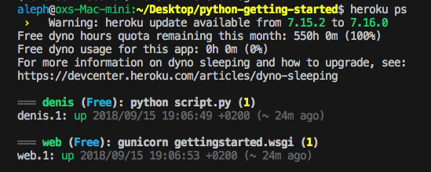

Descripción
=============
Es un bot conversacional.

El motor es J.A.R.V.I.S. (python) y la inteligencia ALICE (aiml). DENIS es un protocolo mqtt para chatear con ALICE.

- J.A.R.V.I.S.: https://github.com/nihal111/J.A.R.V.I.S
- ALICE: https://es.wikipedia.org/wiki/AIML
- DENIS: Demo (NodeJS, Bluemix, Node-Red): http://plaza-aleph.tk/

Detalles de la bifurcación
======================

Respecto de J.A.R.V.I.S., se mantiene la creación del cerebro en el fichero [.script.py](.script.py) para determinar
si es preciso o no cargar el catálogo .aiml de aprendizaje.

Secuencia de arranque del worker Denis, carga de ficheros .aiml:

'''python 

	kernel = aiml.Kernel()

    if os.path.isfile("bot_brain.brn"):
        kernel.bootstrap(brainFile="bot_brain.brn")
    else:
        kernel.bootstrap(learnFiles="std-startup.xml", commands="load aiml b")
        # kernel.saveBrain("bot_brain.brn")
'''

Se han desactivado las funciones locales y el stdIN/OUT queda reemplazado por una subscripción mqtt. Ver detalles
en [./mqtt.py](./mqtt.py).

Secuencia de arranque del cliente mqtt con el que el worker Denis se comunica con las salas de chat:

'''python
	# The callback for when the client receives a CONNACK response from the server.
	def on_connect(self, client, userdata, flags, rc):
		print("Jarvis: Wait, Denis, got a job!")
		print("Jarvis: Connected with result code "+str(rc))

		# Subscribing in on_connect() means that if we lose the connection and
		# reconnect then subscriptions will be renewed.
		#client.subscribe("$SYS/#")
		print("Jarvis:  MQTT is connecting to eclipse...")
		client.subscribe("PLAZA_ALEPH/DENIS/#")
		print("Jarvis:  MQTT sends test message...")
		self.client.publish("PLAZA_ALEPH/DENIS/JARVIS", "Denis & me are back! hello!")		

	# The callback for when a PUBLISH message is received from the server.
	def on_message(self, client, userdata, msg):
		self.in_message(msg.topic, str(msg.payload.decode('UTF-8')))			
	
	def outmessage(self, topic, payload):
		self.client.publish("PLAZA_ALEPH/DENIS_SAYS/" + topic, payload)		

	def start(self, in_message):
		self.in_message = in_message
		self.client.connect("iot.eclipse.org", 1883, 60)
'''

HEROKU VERSION
=============

NOTA: La web se duerme por inactividad. El **primer** acceso la despierta
y tarda considerablemente. Plan Free.

https://denisbot.herokuapp.com/

- Cómo desplegar la aplicación: [Empezando con Python (EN)](https://devcenter.heroku.com/articles/getting-started-with-python#set-up)

- Repositorio: https://git.heroku.com/denisbot.git

Hay dos dynos:

'''
- web: A django web app (See below for link)
- denis: JARVIS doing the Denis background thing

'''

Comando típicos:

- heroku login
- heroku create denis

- git push heroku master
- heroku ps:scale web=1
- heroku ps:scale denis=1
- heroku open
- heroku ps 
- heroku logs -t -p denis

PLAZA ALEPH
===========
La plaza aleph es una sala de chat que usa el protocolo de Denis para contestar a cualquier intervención que se haga
en el chat. Es una implementación IBM Node-Red.

- Editor: https://clanaleph.eu-gb.mybluemix.net/red/
- http://plaza-aleph.thk

Ver detalles:

